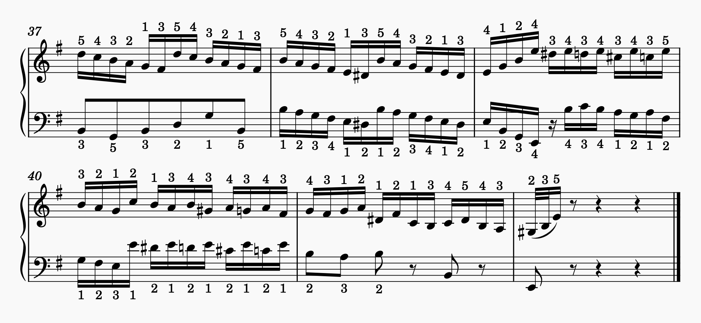
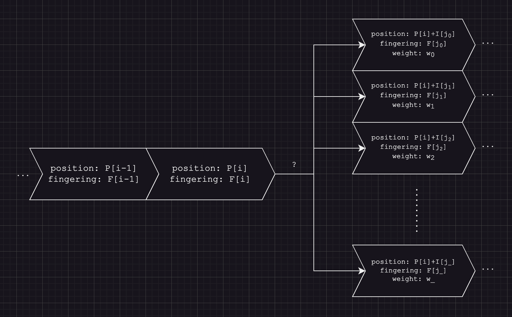

# MusicMark

Automatically predict fingerings for music notes for the piano using RNNs.

## Table of Contents

- [MusicMark](#musicmark)
  - [Table of Contents](#table-of-contents)
  - [Setup](#setup)
  - [Usage](#usage)
    - [Data generation](#data-generation)
    - [Model training](#model-training)
    - [Model prediction](#model-prediction)
  - [Prerequisites (temporary)](#prerequisites-temporary)
  - [File import and export](#file-import-and-export)
  - [Examples](#examples)
  - [Terminology](#terminology)
  - [Problem](#problem)
  - [Solution](#solution)
    - [Data generation](#data-generation-1)
      - [Building blocks](#building-blocks)
      - [Sampled permutation](#sampled-permutation)
    - [Model training](#model-training-1)
    - [Model prediction](#model-prediction-1)
  - [TO-DO List](#to-do-list)

*README last updated December 13th, 2023.*

## Setup

Requires: **python-3.10+**

Create virtual environment:
```bash
pip install virtualenv
virtualenv -p python3 venv3
source venv3/bin/activate
```

Install supplementary libraries:
```bash
pip install -r requirements.txt
```

Key libraries: **torch**, **numpy**

## Usage

### Data generation

```bash
python3 main.py --generate-data \
    --amount=<amount> --length=<length> --out-file=<out_file_path>.<extension> [--help]
```

- `--amount` specifies the amount of training data to generate. Typical values are `100000` to `1000000`.
- `--length` specifies the length of the note sequences to generate. Typical values are `6` to `15`.
- `--out-file` specifies the path to the file that the data will be written to. Extension `.txt` is recommended for DSV.
  - A *left-hand* and *right-hand* version of the data will be generated.
- `--help` displays the same such descriptions.

### Model training

`train/GRU.ipynb` features:
- Data ingestion
- Data preparation
- GRU model definition
- Model training
- Model validation

Key parameters:
- `N_NOTES`: The length of the sequences to be read in. *This is automatically set at runtime upon reading in the file.*
- `TARGET_INDEX`: The index of the note sequence used for prediction *i.e. the model predicts the fingering of the note at index.*
- `DATA_PATH`: Relative/absolute path to the generated data file. A *LH* or *RH* can be fed in to create a *LH* or *RH* model respectively.

### Model prediction

```bash
python3 main.py --predict \
    --rh-model=<rh_model> --lh-model=<lh_model> --in-file=<in_file_path>.<extension> [--help]
```

- `--rh-model` specifies the *right-hand trained* PyTorch-compatible model state file, usually with `.pt` extension.
- `--lh-model` specifies the *left-hand trained* PyTorch-compatible model state file, usually with `.pt` extension.
- `--in-file` specifies the path to the music note encoded file that will be read. See current [supported file formats](#file-import-and-export).
- `--help` displays the same such descriptions.

Resulting annotated file with fingerings will be found at `<in_file_path>_annotated.<extension>`.

## Prerequisites (temporary)

- [x] For the best results, no voice discontinuities should occur where a stream of notes is intuitively continuous within a single voice $^1$
- [x] No exotic varieties of notes should be used, such as grace notes.
- [x] A time signature is required for all measures.

$^1$ Mentioned in [TO-DO List](#to-do-list), some alleviation will be provided through intelligent voice joining, but try best to avoid this issue.

## File import and export

The current supported file reading and writing formats are:
- *.musicxml*

## Examples

Some example outputs after loading the files into *MuseScore 4.0*.

*Johann Sebastian Bach: Fugue in E Minor from Well-Tempered Clavier I*


*Johann Sebastian Bach: Fugue in F# Major from Well-Tempered Clavier I*


## Terminology

**Voice**: In a contrapuntal composition, a contiguous and related series of notes which forms a single layer. Like a human voice, it is often both independent and dependent on the concurrent progression of other voices. The majority of fugues are written with 3-4 voices, though some by *Kaikhosru Sorabji* can go up to 8 concurrent voices.

**Interval**: The semitone distance between any two notes. `+` for ascending, `-` for descending.
- A whole-tone interval is 2 semitones.

**Scale**: Any set of musical notes ordered by pitch. A scale ordered by increasing pitch is an ascending scale, and a scale ordered by decreasing pitch is a descending scale.
- **Major scale**: A diatonic scale made of seven notes with interval sequence for the ascending scale: `(2, 2, 1, 2, 2, 2, 1)`.
- **Minor scale**: A diatonic scale made of seven notes with three variations: *natural*, *harmonic*, and *melodic*.
  - **Natural minor scale**: Has ascending interval sequence: `(2, 1, 2, 2, 1, 2, 2)`.
  - **Harmonic minor scale**: Has ascending interval sequence: `(2, 1, 2, 2, 1, 3, 1)`.
  - **Melodic minor scale**: Has ascending interval sequence: `(2, 1, 2, 2, 2, 2, 1)`.
  
**Scale mode**: Of modern variety and diatonic scales: [Mode (music)](https://en.wikipedia.org/wiki/Mode_(music)#Modern_modes). Not simple to explain here, but for the sake of this project (thus not theoretically accurate but combinatorically equivalent), modes simply represent scale rotations with displacement amounts:
- **Ionian**: 0
- **Dorian**: 1 (*e.g.* C rotated to D)
- **Phrygian**: 2 (*e.g.* C rotated to E)
- **Lydian**: 3 (*e.g.* C rotated to F)
- **Mixolydian**: 4 (*e.g.* C rotated to G)
- **Aeolian**: 5 (*e.g.* C rotated to A)
- **Locrian**: 6 (*e.g.* C rotated to B)

**Arpeggio**: A type of broken chord in which the notes that compose a chord are individually sounded in a progressive rising or descending order.
- Featured chords (where each index is the subsequence index of a reference major scale with alterations):
  - *Triadic*:
    - **Major**: `(1, 3, 5)`
    - **Minor**: `(1, b3, 5)`
    - **Diminished**: `(1, b3, b5)`
    - **Augmented**: `(1, 3, #5)`
  - *Seventh*:
    - **Major**: `(1, 3, 5, 7)`
    - **Minor**: `(1, b3, 5, b7)`
    - **Dominant**: `(1, 3, 5, b7)`
    - **Diminished**: `(1, b3, b5, bb7)`
    - **Half-diminished**: `(1, b3, b5, b7)`
    - **Minor-major**: `(1, b3, 5, 7)`
    - **Augmented-major**: `(1, 3, #5, 7)`

**Arpeggio inversions**: Rotations of the arpeggio with the limit of inversion bounded by the number of notes in the composition of the arpeggio. Arpeggio inversions with displacement amounts:
- **Root inversion**: 0
- **First inversion**: 1
- **Second inversion**: 2
- **Third inversion**: 3 (*Only applies to seventh chords.*)

---

**Relative position**: On a twelve-tone scale, the modular position of a note on the scale, *i.e.* `0` (`C`) to `11` (`B`) inclusive.

**Absolute position**: On a 88-note keyboard, the semitone distance from the lowest octave, expressed as a tuple `(octave, relative_position)` or `octave * 12 + relative_position`.

## Problem

In the process of learning score-based music for pianists, one of the time-consuming aspects of technical refinement is assigning fingerings for the *left hand* and *right hand* to each note on the page. While this becomes a painless, memorizable, and real-time inferrable process for very experienced and professional pianists, it can be a progress impediment for beginner and intermediate learners. And even while it may be only a slight obstacle for professional pianists, I find the process of manually annotating scores for the music I personally play to be exhaustingly time-consuming, perhaps uniquely for pieces like the infamous *Opus Clavicembalisticum*, by *Kaikhosru Shapurji Sorabji* which I have working on tirelessly ([playlist](https://www.youtube.com/playlist?list=PLIDZcmE0XODCfwXtlHvJ3-fZSYVOf5MMR)):

*"XI. Fuga IV [Dux Alter]" from Opus Clavicembalisticum*


## Solution

The solution is three-step: *data generation*, *model training*, and *model prediction* on continuous streams of data.

Due to my limited ability to acquire real-world data that associates actual performer playing of notes with the fingerings they use to play such notes, with my knowledge of music theory and vast practical experience, I decided to systematically generate the data needed to train the *machine learning model* to predict reasonable fingerings for the notes. This generation method is currently not tuned to be ideally aligned with real-world frequency of note and interval values, but is designed to be reasonably close. The procedure is outlined below.

### Data generation

Let a voice, $V$, be represented as a sequence of notes from start to finish. The length of such sequence is denoted as $N$ with $0 \le i < N$, $i \in \mathbb{Z}$. The relative positions of the notes associated with the voice are denoted by $P$ and $|P|=N$ and $P[i] \in \mathbb{Z}, 0 \le P[i] < 12$. The intervals between the notes associated with the voice are denoted by $I$ and $|I|=N-1$ and $I[i] \in \mathbb{Z}$. The fingerings of the notes associated with the voice are denoted by $F$ and $|F|=N$ and $F[i] \in \{1,2,3,4,5,0\}$. A $0$ fingering is a *sentinel* value represents a unassigned fingering and may be represented as `None` in the code.

From practical experience and self-reflective analysis, it was decided that the prediction of the fingering of note $i$ requires $2$ to $4$ preceeding note fingerings and positions and $4$ to $10$ proceeding note positions.

My most common assignment of prior notes is $3$ and proceeding notes is $5$, resulting in $N=9$.
Formally, this means that the prediction of $F[i]$ depends on:
- $P[i-3],...,P[i-1], P[i]$
- $F[i-3],...,F[i-1]$
- $I[i-3],...,I[i-1], I[i]$

and 

- $P[i+1],...,P[i+5]$
- $I[i+1],...,I[i+4]$

Notice that the prediction depends on previous predictions, *i.e. previous outputs are used as inputs recursively*. With an unseeded model and unlabelled data, such previous predictions do not exist. Therefore, abstract representations of scale and arpeggios are created to model common fingerings for such structures.

#### Building blocks

In the code, concrete capped (relative position of start and end notes are same) **ascending note scales** are built with optimized fingerings that maximize comfort based on some complex yet intuitive rules that I will not mention here:


As well, in addition to the above, all modes of all the possible scales are generated as well with the same fingering assignment algorithm, but are not shown because the output would be $15 \times 4 \times 7 = 420$ note sequences long. All the other modes are used as well because it is a common practice in piano performance to preferentially place the thumb (finger $1$) on white keys to maximize comfort, and thus there would be extreme bias on fingering assignment when only *Ionian* mode is used.

In the code, concrete capped (relative position of start and end notes are same) **ascending note arpeggios** are also built with optimized fingerings that maximize comfort with rules that I will also not mention here. As well, the number of possible arpeggios is $15 \times 4 \times 3 + 15 \times 7 \times 4 = 600$ note sequences long with inversions included, so only a small sample of the possibilities are shown below:


Because the idea is now reduced to generating common and reasonable transitions between two notes, each with unique combinations of `(position, interval, fingering)`, the last addition to the generated data involves frequenting intervals that are not visited through scales and arpeggios.

This mainly includes intervals that exceed $4$ semitones upward/downward originating at any finger. This is still an area under development to better capture the remaining transitions, but in the code, the interval ranges for each finger was *hardcoded* in, only requiring about $4$ lines of specification. Such intervals also include $0$ intervals, which is fingering transition on a single note or note repetition. All intervals exceeding $15$ in magnitude ($1.5$ octaves) are not considered or specified as this is a classification task and neural networks use complex decision boundaries which allow the range to extend to negative and positive infinity.

The scales, arpeggios, and custom intervals elements on their own are not quite insufficient for generating the proper distribution of `(position, interval, fingering)` values, as well as many of such linked tuples in sequence. Therefore, one last transformation procedure applied to all building blocks generates a *"half-sine"* representation of the elements, i.e. an ascending and descending version of each element is concatentated together to create an *"upside-down V"* in terms of position. This replicates all `(position, interval, fingering)` tuples for the inverse interval value.

Finally, to accommodate for LH/RH reflection in fingering, models and concrete representations are created for both hands, except all building blocks are inverted for the LH to accommodate differences in base fingerings.

#### Sampled permutation

For any note sequence with length $S$, the number of possible note compositions is infeasibly vast. More specifically, the size of the permutation space is $(12 \times 5) \times 12 ^ {S - 1}$ where the base of the exponent is a reasonable guess, but certainly not far off. For $S = 6$, this is nearly $15$ million. For $S = 9$ like I used before as an example, this is completely computationally infeasible. However, I've been able to use sequences of up to $S = 15$ without problem.

A transition map is made, built from each interval transition from position to position from the scale, arpeggio, and custom interval elements. The transition map also includes weights that are the counters of how frequently each intervals is mapped. To create pseudo-independence between each transition to build a note sequence, a random sampling function chooses $1$ random transition interval from the map weighted by the transition weights. This results in a fairer sampling of the entire permutation space without computating every possibility.



The `--length` and `--amount` command-line parameters control the length of the sequences generated and the number of such sequences to be generated. Post-permutation *filters* and *scoring mechanisms* also exist to optimize the quality of the generated sequences.

The note sequences for LH and RH are then all encoded into separate DSV files readable for model training.

### Model training

Two models must be trained: one for the LH and one for the RH. `N_NOTES` is a variable in the model training notebook which is equal to $N$. `TARGET_INDEX` is the index of the note sequence used for prediction. For the purpose of simplicity, let the following walkthrough use `N_NOTES` $=N=6$ and `TARGET_INDEX = 2`, where `TARGET_INDEX` is zero-indexed.

A visual and spatial representation of the data is the following:


The following transformations are applied on the read-in values to create features:
- For each $i$, apply circular transformation: compute $\sin(P[i])$ and $\cos(P[i])$. This creates spatial locality between $P$ values $0$ and $11$.
- For each $i$, scale each interval value from $I$ down by a factor of $12$ to create similar relative magnitudes as other features.
- For each $i$, apply 1-hot encoding for the fingerings $F$ used as part of the recursive input. The dimension of the 1-hot encoding is $6$ to account for the *sentinel* value of $0$. Zero all fingerings at index `> TARGET_INDEX` to hide the expected values.
- Prepend $F$ and $I$ with a padding $0$ value.

The neural network model used is the Gated Recurrent Unit (GRU), a type of Recurrent Neural Network (RNN). It is effective as it is designed to be sequentially fed with sequential data like what is present. It is also designed to avoid exploding/disappearing gradients. Negative log-likelihood loss (`NLLLoss`) is used in combination with a log-softmax activation function to create a probabilistic output distribution. The model is created using `PyTorch` and is composed of a 2-layer hidden matrix, each layer composed of $32$ nodes.

Before sending the data to the model, a **permutation** is also applied on $P$, $I$, and $F$ so that the value to be predicted is at the end of the sequence, thus the permutation is the following in pseudocode:

```python
PERMUTATION = (0, ..., TARGET_INDEX - 1, TARGET_INDEX + 1, ..., N - 1, TARGET_INDEX)
```

The following is a diagram of how the feed-forward process proceeds during model training:


The resulting models for both LH and RH can be saved. Currently, models pass validation at approximately $80\%$ to $90\%$ accuracy.

### Model prediction

Upon reading in and parsing the note information provided by a data-encoded file, the positions and intervals are extracted.

Rests in the music do not have intervals with adjacent notes.

Because one of the more desirable but challenging aspects of fingering assignment involves assigning fingerings to multiple voices commanded by one hand and/or chords present in a single voice, the structures must be flattened from the possibility of multiple simultaneous/concurrent notes into a note sequence that is compatible with the trained model. Thus, if what's below is interpreted as two voices commanded by one hand, then the note extraction is the following:


The darker arrows represent the held duration of each note, while the bright white arrow represents the order the note sequence is represented. Note the duplication of held notes added to the sequence upon the progression of other voices. This is due to the observation that any chord can be arpeggiated and still possess an equivalent fingering to the solid held chord.

However, this was a preliminary design choice that has now seen to be insufficient at capturing the adjacency of the fingerings of independent voices, so a slight redesign is needed.

Upon flattening of a hand's (LH/RH) voices into a 1-dimensional note sequence, the monolithic note sequence is split using *rests* as a *delimiter*. Due to the fact that the model requires prior information in the form of positions, intervals, and fingerings: for each subsequence, $0$-padding is applied to the left and right of the subsequence, enough to allow the indices to under- and over-shoot the boundaries such that every position $i$ of $P$ undergoes fingering prediction.

The process is illustrated below on `N_NOTES = 6` and `TARGET_INDEX = 2`:


Note that, unlike model training, predicted fingerings are fed back into the model, hence the name Recurrent Neural Network. And thus, fingerings are assigned to each note, and re-encoded back into an output data format.

Total runtimes of the model prediction process have been less than $0.5$ seconds for *Bach's* fugues from the *Well-Tempered Clavier*.

## TO-DO List

- [ ] Automated intelligent voice joining $^1$
- [ ] Chord handling redesign
- [ ] Remove need for time signature
- [ ] Further improve validation accuracy and robustness of GRU model

$^1$ Mainly because of human score design, at some points, the voice assignment of a relatively continuous stream of notes changes even though it shouldn't. This can cut a voice into pieces and create discontinuities in fingering, though relatively insignificant.
